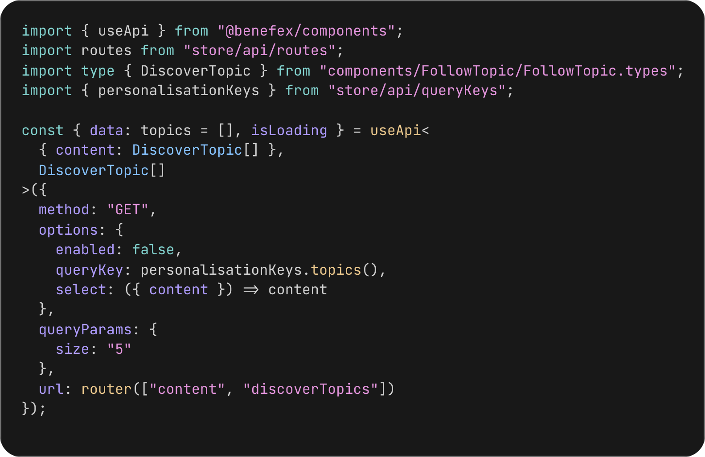
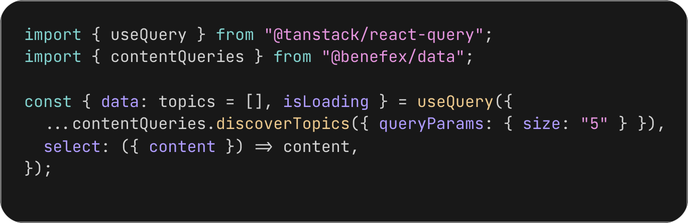
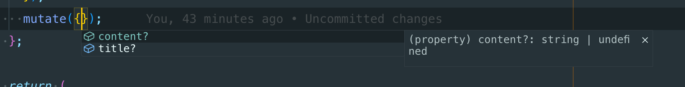
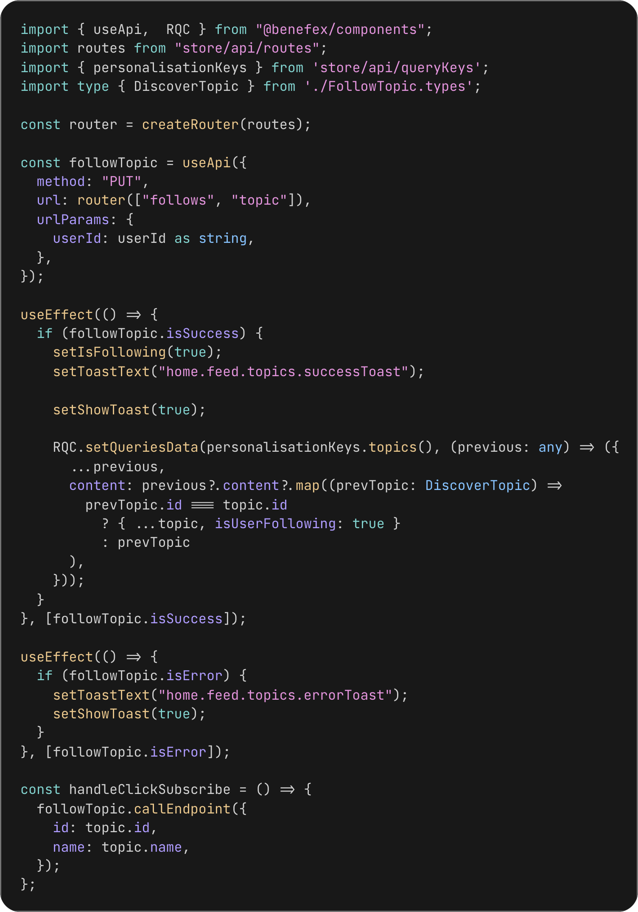
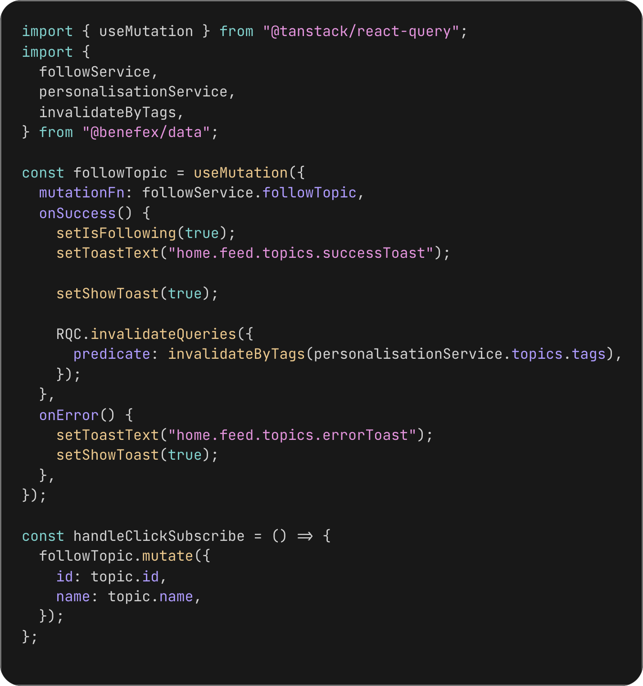
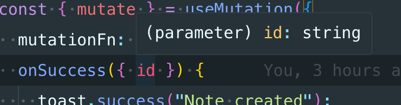
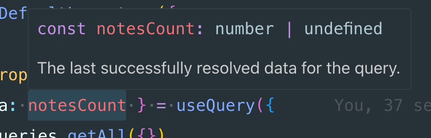

# @benefex/data Proposal

The @benefex/data package builds on the concepts behind both `useApi` and our Redux sagas.

Its primary focus is centralising service creation and types. It will also provide convenience methods for React Query, though this could be expanded to more libs in the future if we migrate away from React Query ([see SWR example](src/pages/Note/Note.tsx#L24)).

## How Will It Work?

### Service Definitions

A service definition is a logical group of endpoints. This might be an entire API (e.g., Alerts) or a subset (e.g., WalletUser). It contains key information to facilitate the creation of data-fetching helpers.

- **url**: The endpoint for the API. `:userId` and `:companyId` are automatically populated from the user's token unless specified in `urlParams` (similar to useApi and Redux).
- **tags**: These form part of the `queryKey` and are used for invalidation ([see invalidators](src/api/index.ts)).
- **call**: This defines the logic for the service. Its only requirement is a URL; however, other common properties are also typed using the `ServiceArgs` helper.

Example:

```ts
const notesService = {
  get: createService({
    url: "/notes/:noteId",
    tags: ["notes"] as const,
    // urlParams only
    call: (args: ServiceArgs<NoteParams>) => mockFetcher<Note>(args),
    // urlParams and queryParams
    // call: (args: ServiceArgs<{ urlParams: NoteParams, queryParams: NoteQuery }>) => mockFetcher<Note>(args),
  }),
  create: createService({
    url: "/notes",
    call: ({ url, body }: ServiceArgs<{ body: CreateNote }>) =>
      mockFetcher<Note>({ url, options: { method: "POST", body } }),
  }),
};
```

### Query Helpers

A query helper is a wrapper around React Query's `queryOptions` API.

Example:

```ts
export const notesQueries = {
  get: createQuery(notesApi.get, { staleTime: ms("5m") }), // Adds a default cache time of 5 minutes, can be overidden,
  getAll: createQuery(notesApi.getAll),
} satisfies Record<keyof typeof notesApi & `get${string}`, unknown>;
```

## Example query migration

Everything is typed based on the service definitions, useQuery (including select) and useMutation (including onSuccess etc.) inherit the types automatically. No more generics :tada:

| Before                       | After                      |
| ---------------------------- | -------------------------- |
|  |  |

## Example mutation migration

It's worth noting that currently mutations are completely untyped and in the migrated version they are fully typed.



| Before                            | After                          |
| --------------------------------- | ------------------------------ |
|  |  |

## Files with examples

### [Notes](src/pages/Notes/Notes.tsx)

- useQuery
- useMutation with [invalidate by tags](src/pages/Notes/Notes.tsx#L24) (similar to queryKeyFactory) `invalidateByTags(notesApi.getAll.tags)`
- Form with invalidation

### [Note](src/pages/Note/Note.tsx)

- useSuspenseQuery - [Example](src/pages/Note/Note.tsx#L22), [Error handling](src/layouts/Default.tsx#L34), [Global Loader](src/layouts/Default.tsx#L38)
- useMutation with single endpoint invalidation
- - Example 1: [Refetch](src/pages/Note/Note.tsx#L34)
- - Example 2: [Invalidate by params](src/pages/Note/Note.tsx#L37) `invalidateByUrlParams(notesApi.get, { noteId: id! })`
- - Example 3: [Invalidate by url](src/pages/Note/Note.tsx#L42) `invalidateByUrl(notesApi.get, { noteId: id! })`
- - Example 4: [Invalidate by queryKey](src/pages/Note/Note.tsx#L47) `notesQueries.get({ noteId: id! }).queryKey`

### [Create Note](src/pages/CreateNote/CreateNote.tsx)

- useMutation with [typesafe onSuccess redirect](src/pages/CreateNote/CreateNote.tsx#L49)
- Form with toast



### [Layout](src/layouts/Default.tsx)

- useQuery with [typed select](src/layouts/Default.tsx#L9)



### [API](src/api/note/api.ts)

Service definitions are not tied to a specific data fetching library. This means they can be used by Redux, RTK, React Query, useSWR or any other lib.

- Service definitions
- [Example using useSWR](src/pages/Note/Note.tsx#L24) and the [hook factory](src/api/helpers/swr.ts)

### [Hooks](src/api/note/hooks.ts)

These are query helpers for react query see https://tkdodo.eu/blog/the-query-options-api for an explantion of why we want these instead of explicit hooks such as `useNotes`.

- React query hooks
